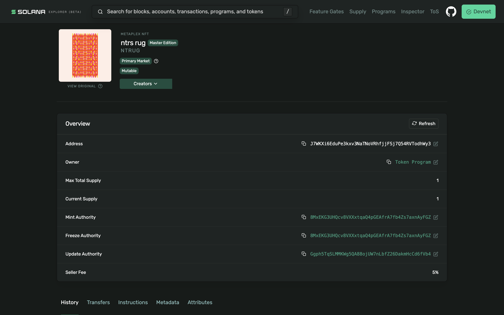
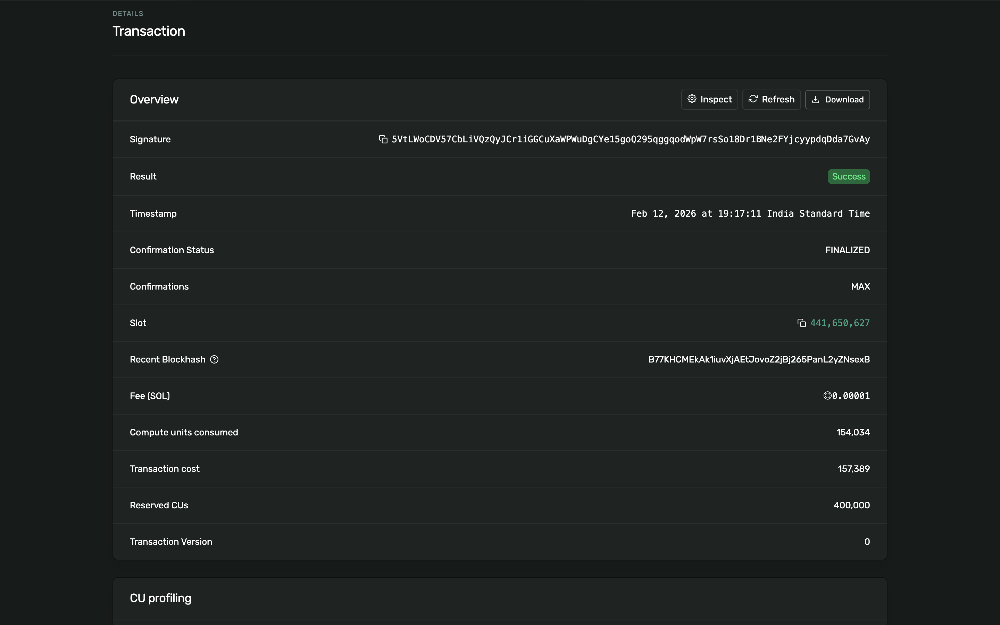
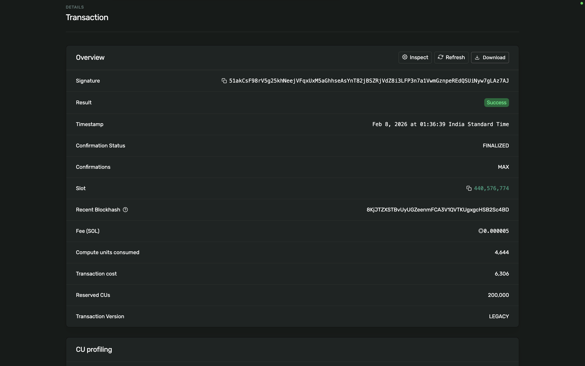
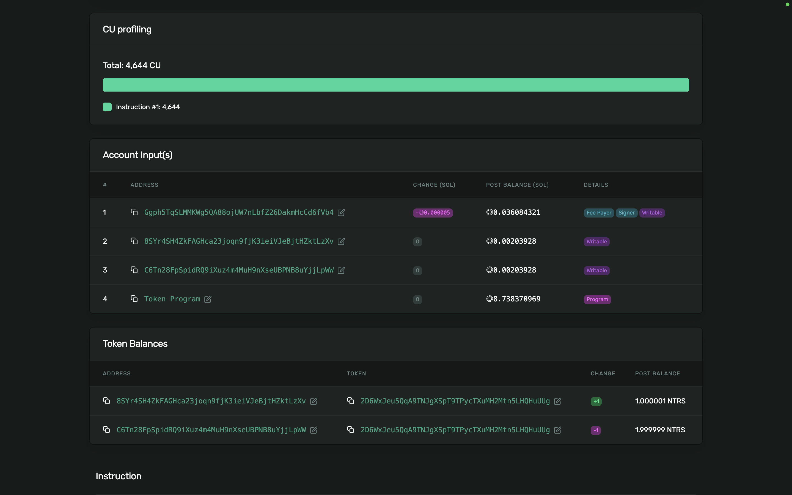
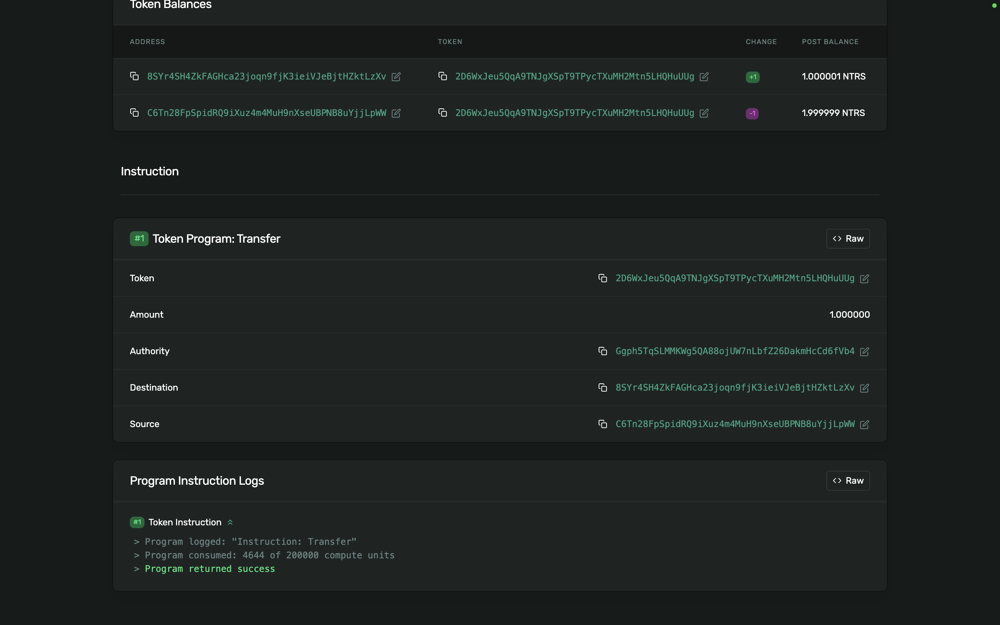

# NFT Mint

**mint address:** J7WKXi6EduPe3kxv3NaTNoVRhfjjFSj7Q54RVTodhWy3
tx: https://explorer.solana.com/tx/5VtLWoCDV57CbLiVQzQyJCr1iGGCuXaWPWuDgCYe15goQ295qggqodWpW7rsSo18Dr1BNe2FYjcyypdqDda7GvAy?cluster=devnet

- 
- 

# NFT Transfers!

- 
- 
- 

**Problem Statement**

- **Core Problem:** Malicious actors can spoof token names and logos in metadata to impersonate legitimate NFTs. Users relying on visual cues (name, logo) can be tricked into transferring valuable NFTs or tokens to fraudulent recipients or smart contracts.
- **Impact:** Users may lose assets when they approve transfers or listings for tokens/NFTs that only look legitimate but are controlled by attackers.
